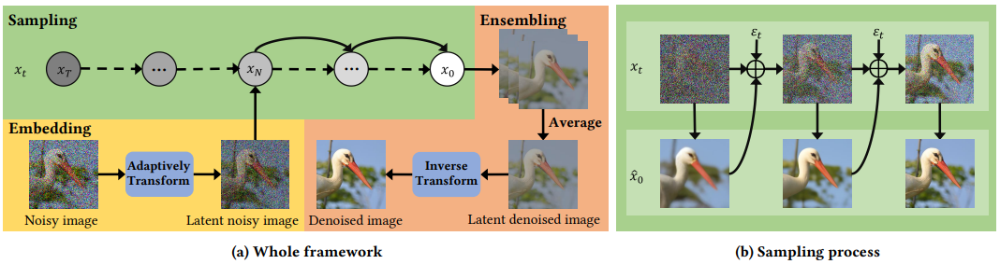

# Stimulating the Diffusion Model for Image Denoising via Adaptive Embedding and Ensembling

<hr />

>**Abstract:** *Image denoising is a fundamental problem in computational photography, where achieving high-quality perceptual performance with low distortion is highly demanding. Current methods either struggle with perceptual performance or suffer from significant distortion. Recently, the emerging diffusion model achieves state-of-the-art performance in various tasks, and its denoising mechanism demonstrates great potential for image denoising. However, stimulating diffusion models for image denoising is not straightforward and requires solving several critical problems. On the one hand, the input inconsistency hinders the connection of diffusion models and image denoising. On the other hand, the content inconsistency between the generated image and the desired denoised image introduces additional distortion. To tackle these problems, we present a novel strategy called Diffusion Model for Image Denoising (DMID) by understanding and rethinking the diffusion model from a denoising perspective. Our DMID strategy includes an adaptive embedding method that embeds the noisy image into a pre-trained diffusion model, and an adaptive ensembling method that reduces distortion in the denoised image. Our DMID strategy achieves state-of-the-art performance on all distortion-based and perceptual metrics, for both Gaussian and real-world image denoising.*
<hr />

## Pipeline of DMID
 


## Quick Start
```
python main_for_gaussian.py
```
```
python main_for_real.py
```

## Evaluation
- Download the pre-trained Diffusion model and place it in `./pre-trained/`.
- Download testsets (CBSD68, Kodak24, McMaster, Urban100, ImageNet, CC, PolyU, FMDD).

#### Gaussian image denoising testing
- To obtain denoised images, run
```
python main_for_gaussian.py --data_path your_data_path --dataset test_dataset_name --test_sigma test_noise_level --S_t Sampling_times --R_t Repetition_times
```
*[^_^]:- To reproduce the reported results, run
#### Real-world image denoising testing
- To obtain denoised images, run
```
python main_for_real.py --clean_path clean_data_path --noisy_path noisy_data_path --datatype test_dataset_name --pertrianed latent_images_path --objective objective
```
## Results
#### Gaussian image denoising
 

#### Real-world image denoising
 

#### Classical Comparison
 

