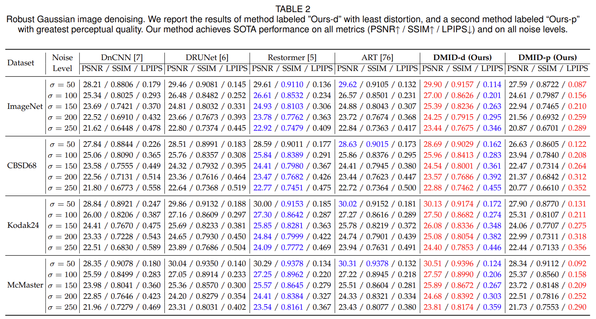

# Stimulating Diffusion Model for Image Denoising via Adaptive Embedding and Ensembling

<hr />

>**Abstract:** *Image denoising is a fundamental problem in computational photography, where achieving high perception with low distortion is highly demanding. Current methods either struggle with perceptual quality or suffer from significant distortion. Recently, the emerging diffusion model has achieved state-of-the-art performance in various tasks and demonstrates great potential for image denoising. However, stimulating diffusion models for image denoising is not straightforward and requires solving several critical problems. For one thing, the input inconsistency hinders the connection between diffusion models and image denoising. For another, the content inconsistency between the generated image and the desired denoised image introduces distortion. To tackle these problems, we present a novel strategy called the Diffusion Model for Image Denoising (DMID) by understanding and rethinking the diffusion model from a denoising perspective. Our DMID strategy includes an adaptive embedding method that embeds the noisy image into a pre-trained unconditional diffusion model and an adaptive ensembling method that reduces distortion in the denoised image. Our DMID strategy achieves state-of-the-art performance on both distortion-based and perception-based metrics, for both Gaussian and real-world image denoising.*
<hr />

## 🚀 News

- 2024.5.10 our paper has been accepted by TPAMI! :tada: :confetti_ball:

- 2024.6.4 the code and the tools are all released! 🚀

## ⏳ Todo lists

- We will supplement the code about noise transformation within a month (before 6.12). [x] We have released the code in 2024.6.4.
- We may release our other methods [] ...

## Pipeline of DMID
 


## Quick Start
- Download the pre-trained unconditional diffusion [model](https://openaipublic.blob.core.windows.net/diffusion/jul-2021/256x256_diffusion_uncond.pt)(from [OpenAI](https://github.com/openai/guided-diffusion)) and place it in `./pre-trained/`.

- Tp quick start, just run:

```
python main_for_gaussian.py
```
<!--
```
python main_for_real.py
``` 
-->

## Evaluation

- All the [visual results](https://github.com/Li-Tong-621/DMID/releases/tag/v1.0) are available.
- Download [testsets](https://github.com/Li-Tong-621/DMID/releases/tag/v1.0) (CBSD68, Kodak24, McMaster, Urban100, ImageNet), and place the testsets in './data/', eg './data/CBSD68'.
- Download the [testsets](https://github.com/Li-Tong-621/DMID/releases/tag/v1.0) after noise transformation (CC, PolyU, FMDD), and replace the folder named '.pre-trained' with the downloaded testsets.
- Download the pre-trained unconditional diffusion [model](https://openaipublic.blob.core.windows.net/diffusion/jul-2021/256x256_diffusion_uncond.pt)(from [OpenAI](https://github.com/openai/guided-diffusion)) and place it in `./pre-trained/`.


<!--
#### Gaussian image denoising testing
- To obtain denoised images, run
```
python main_for_gaussian.py --data_path your_data_path --dataset test_dataset_name --test_sigma test_noise_level --S_t Sampling_times --R_t Repetition_times
```
-->

<!--
#### Real-world image denoising testing
-->
<!--- 
- To obtain denoised images, run
```
python main_for_real.py --clean_path clean_data_path --noisy_path noisy_data_path --datatype test_dataset_name --pertrianed latent_images_path --S_t Sampling_times --R_t Repetition_times
```
-->


- To quickly reproduce the reported results, run
```
sh evaluate.sh
```

<!---
- To quickly reproduce the reported results of CC, run
```
python main_for_real.py --clean_path './data/CC-full/GT/' --noisy_path './data/CC-full/Noisy/' --datatype 'CC' --pertrianed './pre-trained/CC.pt' --S_t 1 --R_t 1
```
```
python main_for_real.py --clean_path './data/CC-full/GT/' --noisy_path './data/CC-full/Noisy/' --datatype 'CC' --pertrianed './pre-trained/CC.pt' --S_t 2 --R_t 500
```
-->


## Tools
-  🔨 All the details of setting details of different tables can be found in the paper.
-  🔨 To calculate timestep N for a given noise level, we provied two version code, you can find them in [https://github.com/Li-Tong-621/DMID/utils](https://github.com/Li-Tong-621/DMID/tree/main/utils)

```
python utils_cal_N.py
```
```
python utils_cal_N_2.py
```

-  🔨 To perform our improved noise transformation by yourself:

```
python main_for_real_NT.py
```

-  🔨 We provide a new code for real-world image denoising (main_for_real.py), because there are some errors, which i didn't find, in original code for real-world image denoising (main_for_real_o.py).


## Results
<details close>
<summary><b>Classical Gaussion denoising</b></summary>

 
 
</details>

<details close>
<summary><b>Robust Gaussion denoising</b></summary>

 
 
</details>

<details close>
<summary><b>Real-world image denoising</b></summary>

 
 
</details>

<details close>
<summary><b>Compared with other diffusion-based methods</b></summary>

 
 
<!-- 这部分内容将被隐藏 -->

</details>
